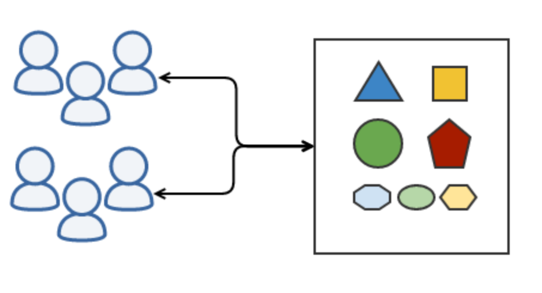
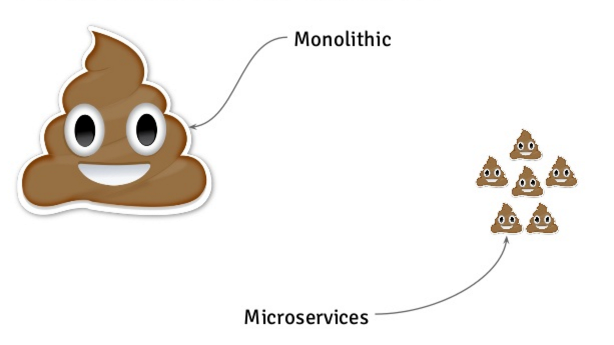

# Microservices beyond the trench

### Qui sommes nous

## Introduction

### Pourquoi nous avons fait ce choix

#### Monolith



> VV: Un gros serveur HTTP qui gère tout les services
>
> Complexe à scaler : sessions, synchro data, un point tombe tout tombe 
>
> ER: Exemple des enchéres : à heure précise jusqu'à 400 personnes qui rechargent toutes les secondes, pas de cache car les données doivent être à jour en live
>
> Grossir à 1000 ou 2000 avec un monolith est compliqué, il nous fallait pouvoir sortir ça 

#### Microservice


### Les objectifs (VV)

* scalabilité
* résilience
* agilité 
* transition progressive

> On ajoute autant de serveurs que l'on a besoin
>
> survis quoi qu'il arrive, pas d'astreintes
>
> simple à déployer, mettre à jour et utiliser, minimaliste donc simple à tester et à documenter
>
> Et bien sur : transition simple avec l'existant et pouvoir garder des choses sur le monolith

### Lettre au père noël


> ER: Côté PHP nous avons suivi le design pattern du

## Le CommandBUS 

1. Orienté processus métier
2. Isolation du code (des responsabilités)
3. Abstraction de la source et de la réponse

> @todo peu de de dépendances
>
> 1. On gagne une cohérence avec le business
> 2. Simple à tester, réduit les cas de problèmes
> 3. Quel que soit où l'on soit on peut passer par là pour éxecuter : HTTP, Console, AMQP, ZMQ ..
> 4. à quoi ça ressemble, pour une participation à une enchère

### Command

```php
<?php
/**
 * @param float $amount
 * @param string $user_id
 * @param string $auction_id
 */
class AuctionRaiseCommand extends Command {
	public static $handlers = [
  		AddUserToAuction::class,
      	CheckBidAmount::class,
      	NotifyParticipants::class
	];  
  	public function __construct(array $attributes = []) {
      	// Validation
  		parent::__construct($attributes);
	}
}
```

### Handler

```php
<?php
class AddUserToAuction {
  	protected $auction;
  	public function __construct(AuctionRepository $auction) {
  		$this->auction = $auction;
	}
	public function handle(AuctionRaiseCommand $command) {
  
	}  
}
```

### Bus

```php
<?php
  $bus = new SimpleBus();
  $bus->handle(new AuctionRaiseCommand([
    'user_id'=> '',
    'auction_id'=>'', 
    'amount' => ''
  ]));
```


> Pour le rendre vraiment magic, les capacités et middlewares
>
> VV: Ce qui est bien c'est qu'il peut se transformer simplement via des middlewares, par exemple je veux que ma commande soit rééssayée plus tard si elle plante et qu'elle emette des événements lors de son éxecution

### Capacities

```php
class AuctionCommand implements RetryOnFail, IsHandledAsynchronously {
	public function getMaxRetry();
  	public function getWorker();
  	public function getRetryDelay($tried);
}
```

> via des middleware simplement ajoutés au bus

### Middleware

```php
<?php
  $bus = new SimpleBus();
  $bus->appendMiddleware(new AsynchronousMiddleware());
  $bus->appendMiddleware(new RetryOnFailMiddleware());
```

> Plusieurs librairies dispo des plus simples : tactician et simplebus aux plus complexes : broadway et prooph

## Communication


> Client envoit amount, auction et son id
>
> api valide, transfert à un worker et répond OK
>
> Le worker fait le travail demandé et notify les serveurs de websocket
>
> Chaque serveur websocket push à ses clients connectés le changement

### Méthodes


> ER : les fléches c'est bien beau mais ça a jamais envoyé de paquet
>
> php permet de mettre en place cette architecture

### Délégation avec ack 

```php
class Worker extends Console {
  protected $signature = 'worker {--bind=tcp://0.0.0.0:25001 listen on}';
  public function handle(Httpd $httpd) {
    $httpd->route('POST', '/', function(Request $request, Response $response) {
      	$response->send("OK")
          ->subscribeCallback(null, null, function() {
    		 SyncBus::handle($request->getCommand());  
		  });  
    })
    $httpd->listen($this->option('bind'));
  }
}
```

### Pub Sub vers la websocket en ZMQ 

#### Code push

```php
$pub = $zmq->push("tcp://pusher.svc.domraider.com:23499");
$pub->send(new AuctionRaisedEvent());
```

#### Code pull

```php
$sub = $zmq->pull("tcp://0.0.0.0:23499");
$sub->subscribeCallback(function(AuctionRaisedEvent $event) {
	foreach($this->webSocket->sessions as $session) {
  		$session->send($event);
	}
});
```

> et pour la websocket allez voir thruway :)

### Enchère 


> Avantages : tout est au minimum doublé, résilience assurée. 
>
> La charge s'allége grace aux websocket la mise à jour est plus rapide

#### Auction n'est pas notre seul process métier


> vv: Au total ces petits services deviennent nombreux, actuellement nous en avons 63 qui tournent en production, ce qui représente presque 400 process, les workers gèrent en moyenne 4k commandes par minute
>
> gérer un monolith de quelques vm c'est déjà du boulot alors 63 services sans aide c'est impossible

## Orchestration


ou rancher ou swarn disponible openshift, google container engine

> TODO remplir

### Orchestration et supervision

> Gère la distribution des services et de leur réplicas
>
> si un service tombe le redémarre, si une machine tombe cherche une autre machine qui correspond

### Scale

> Si on est sur une énorme session avec 2000 participants, un worker ne gérera pas tout, on va pouvoir en vouloir 5,

```
kubectl scale --replicas=5 rc AuctionWorker
```

### Update et rollback

* Démarrage d'un pod avec la nouvelle version
* Attente du démarrage effectif
* Arrêt des pods avec la version précédente

> Si il est capable de scaler, il gère aussi la mise à jour en blue green

```bash
kubectl rolling-update --image=worker:latest worker
```

### Routage et adressage (er)

* un pod = 1 ip fixe
* un service = 1 entrée DNS
* ttl faible 500ms
* failover par service

```php
$pub = $zmq->pub("tcp://pusher.svc.domraider.com:23499");
$pub->send(new AuctionRaisedEvent());
```

> Fournis des adresses IP dynamiques pour tout les serveurs
>
> Un serveur DNS à ttl faible pour trouver les services
>
> Un proxy pour le load balancing et le failover automatique

## Vivre avec  (vv) 

> le mariage ça sert à régler à deux des problèmes que l'on aurait jamais eu si on était tout seul

### Centraliser les logs


> L'enchère que l'on a vu tout à l'heure aura pu s'executer sur 3 machines, si je doit suivre sa trace en explorant les machines ça peut être long

Graylog, ELK ou Loggly / logstash ...

```bash
// docker graylog
// Monolog Gelf Logger
```

### Centraliser les bugs

> Comme pour les logs, on peut perdre beaucoup de temps à partir en quête d'un bug sur un fichier log

Sentry, ou new relic 

```php
// code sentry catch exceptions
```

### Automatiser les build (er)

> Un codebase donne x builds dockers qui vont donner eux mêmes y replication controller dans kubernetes
>
> Besoin d'un build automatisé avec versionning
>
> une image docker par version, le build ne donne pas forcément lieu à un déploiement

jenkins docker , circle ci

```bash
// Script de build docker
composer install
cp docker/worker/Dockerfile .
cp docker/worker/.dockerignore .
docker build -t worker:$version .
docker tag latest worker:$version
docker push worker:$version
docker push worker:latest
```

### Monitoring fin (vv)

> Besoin de comprendre ce qui se passe sur un service comme sur une machine, et d'être alerté quand quelque chose se passe mal
>
> Alertes métiers comme techniques

InfluxDB et grafana, Tick, Prometheus : ou datadog



## Après 1 an 

> l'architecture ne résoud pas tous les problèmes, besoin d'avoir la compréhension complète du service et de ses problèmes avant de passer au microservice.
>
> Evolution très rapide des solutions sur lesquelles on travaille 
>
> Les merdes sont plus simples à gérés (plus isolées)
>
> Coût pour rentrer dedans : docker, kubernetes, le pattern du command bus, des librairies matures de communication en PHP (ZMQ top, mais pas top en serveur HTTP), le travail en event (React, EV)


> Scalabilité et agilité au top, résilience on a encore des downtimes  (même si résolu automatiquement) encore du monolith
>
> temps d'intégration d'un nouveau dev simple 

## RTFM

- source pour faire tourner les exemples et slides
- kubernetes doc
- simplebus  et le command bus pattern
- reactive programming
- ZMGuide

## Fin

Des questions ?

ps. On recrute à Clermont Ferrand ;)